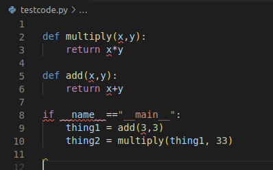
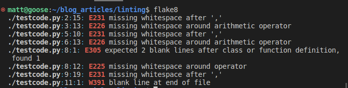
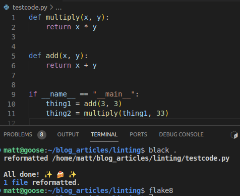

Flake8 is a linting tool that will check code formatting according to PEP8 standards. Flake8 will not change or fix the code. One would have to use a tool like the Black formatter to actually do the fixes. 

Install flake8 in your environment as per their documentation

Below we have a very simple bit of python code that looks innocent enough. 

First you may note the red underlines. These aren't errors. These are being flagged by vscode because I have a .flake8 file located in the root directory.  

To see what's wrong, we can run flake8 in the terminal to see what the exact issues are. 

Here we can see a great description of all of the issues it found. Let's just use the autoformatter, black, to knock out those issues.

We can see that black knocked out those issues for us. Running flake8 again reveals that there arent any more issues.

Let's check out that .flake8 file, though.

A referenced for the error codes can be found in the flake8 docs [here](https://flake8.pycqa.org/en/2.6.0/warnings.html).
