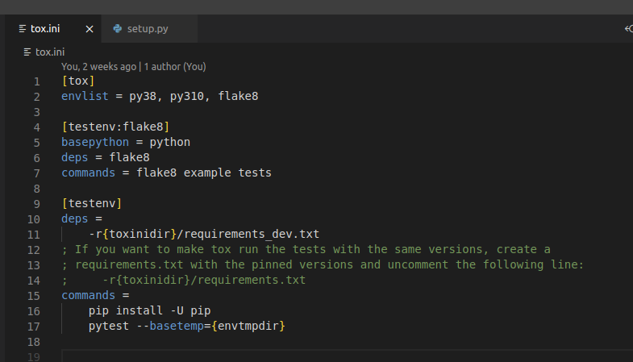
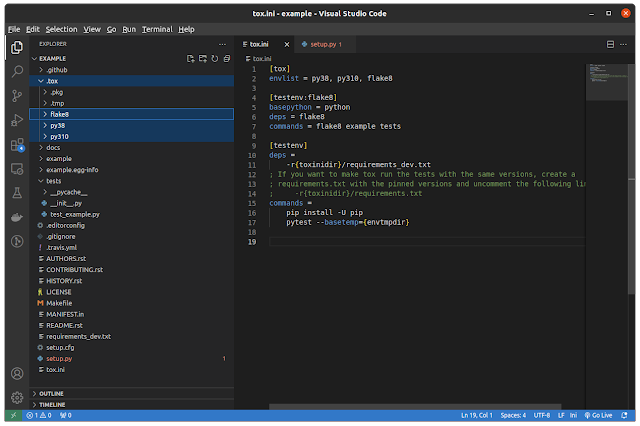
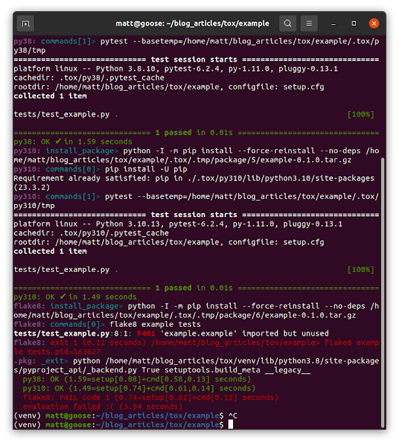

+++
title = "Testing with Tox"
description = "Tox for Testing Multiple Python Versions"
date = "2024-01-30T21:54:09-06:00"
tags = ["Python", "testing", "tox"]
categories = ["", ""]
draft = false
+++
This is a tutorial for how to use python tox to automate the testing of a package that needs to be testing for multiple software versions. 

What tox really does for you is to create and manage virtual environments. It enables you to make sure that both the software installs correctly and that the tests run. It can do other tasks related to deployment, but we are just going to talk about testing today. 

Tox documentation [here](https://tox.wiki/en/4.12.1/). 

You must have the python versions you wish to test with installed and discoverable on the path. 
Prerequisites:
1. An active environment with tox installed. 
2. Additional python versions installed as necessary. 
3. You can have pytest or whatever test framework you want. 

While this isnt an article on installing other versions of python, here is a quick link for how to do it. I'm on ubuntu so that's what i'm using. 

Python 3.8 was the default on my system. We are going to test on 3.8 and 3.9. I have installed python 3.10 as an altinstall

Let's throw together a quick testable project using cookiecutter:

`cookiecutter https://github.com/audreyr/cookiecutter-pypackage.git`

Enable Pytest when prompted. Our project is just called example.

This sort of takes the fun out of things because it already provides us with a tox.ini file. Let's take a look at it:

Just to note, the original included a section on travis CI which i removed as well as a couple of versions of python that we weren't testing with. 

envlist specifies the environments that we want to test with. py{xy} is the format that is interpreted by tox and is not the executable alias. 

When tox is run it will make 3 virtual environments as specified in the .tox folder as seen below. For the environment that does not have a version specified, it will use the version of the current environment. This was done in a python 3.8 virtual environment, so it will run it's flake8 tests with python3.8.

[testenv] labels a set of commands to be ran with every environment specified by a python version. 
So in this example, it will only run the test suite with the newly created py38 and py310 environments in the .tox folder. 

dep is fairly self explanatory. it makes sure that a particular specified set of dependencies are in installed in the virtual enviornmen when it runs these commands

The command section is where the magic happens. These can be any commands separated by a line break. They do not only have to be python commands. They will be ran in order. 

So say we have a complicated install script that runs as a bash file. We can put that command in here first and it will be ran prior to running the pytest command

Running the tox command will result in the following:

We can see that we failed our flake environment but the two test environments passed.

Notes:
1. An individual environment can be called with tox -e <envname>
2. the {args} keyword can be used in the commands such as pytest to let you pass command line arguments through to your commands.
